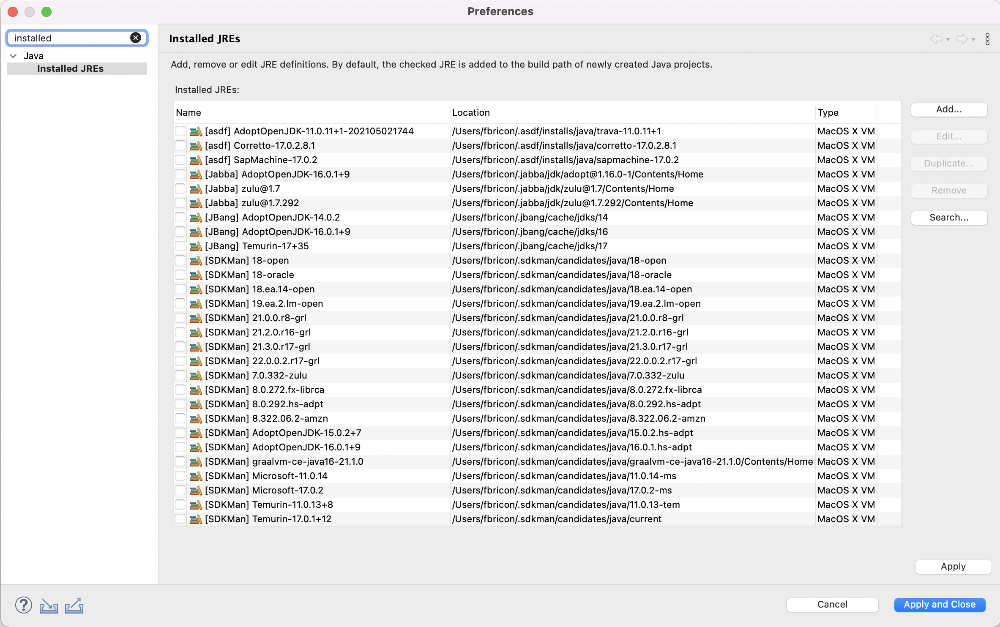

# JRE Discovery

This feature allows the automatic discovery of managed Java Runtime Environments in Eclipse. 
It currently detects JREs managed by :
- [SDKMan](https://sdkman.io/), 
- [asdf-java](https://github.com/halcyon/asdf-java), 
- [Jabba](https://github.com/shyiko/jabba) 
- [JBang](https://www.jbang.dev/)

Managed JREs will be automatically discovered on Eclipse startup, or, while running, when added by their respective Java managers.

Installation
------------
You can install it directly from the [Eclipse Marketplace](https://marketplace.eclipse.org/content/jre-discovery).

Alternatively, in Eclipse:

- open Help > Install New Software...
- work with: `https://sidespin.github.io/jre-discovery/snapshots`
- expand the category and select the JRE Discovery Feature
- proceed with the installation
- restart Eclipse

Build
-----

Open a terminal and execute the following command:
- On Linux/Mac:

> ./mvnw clean verify
    
- On Windows:
    
> mvnw.cmd clean verify

You can then install the generated update site from `io.sidespin.jre.discovery.site/target/io.sidespin.jre.discovery.site-<VERSION>-SNAPSHOT.zip`

# License

Licensed under the [EPL-2.0](https://www.eclipse.org/legal/epl-2.0/).